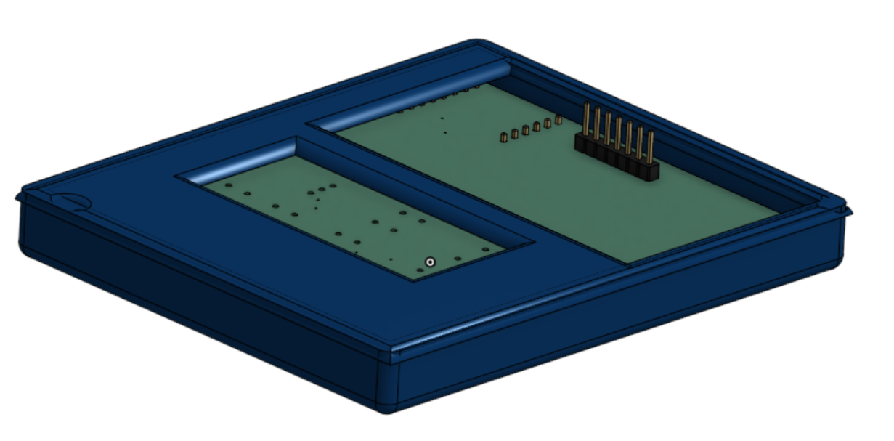
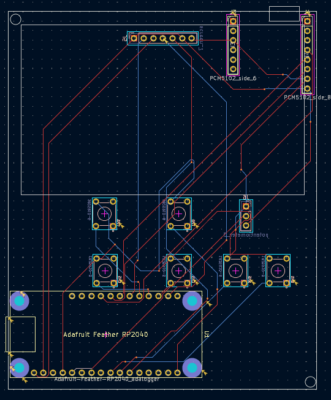
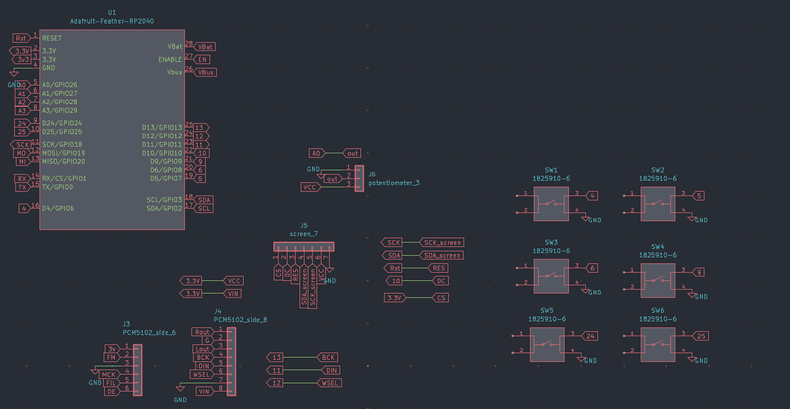

# Personal Audio Player

## Project Overview
A pocket-sized, RP2040-based audio player featuring:
- **Adafruit Feather RP2040 Adalogger** (built-in microSD slot & Li-Po charger)
- **Adafruit PCM5102A DAC** breakout board that also includes audio jack
- **2.4″ SSD1309 128×64 OLED** display (I²C)
- **Six 6 × 6 mm tactile buttons** for menu navigation & transport controls
- **One 10 kΩ potentiometer** for volume control
- no firmware...yet
---
## Case

## PCB 

## Schematic

---
## BOM

| item | quantity                                   | link                                      |
|----:|--------------------------------------------------|--------------------------------------------|
| rp2040 adalogger  | 1 |  [link](https://www.adafruit.com/product/5980?srsltid=AfmBOoo8XiFZ5O-aQrgWYq57rMrMTgJX_qIoyT-_eMKxOjlOtefi_cEq) |
| pcm5102a  | 1 |  [link](https://www.adafruit.com/product/6250?srsltid=AfmBOoqd1F7VRiLRdiD3oSu3U9al2WLzJexfJeOLYhPyQlxJku6weyUe)     |
| 2.4" oled display | 1  | [link](https://www.adafruit.com/product/6250?srsltid=AfmBOoqd1F7VRiLRdiD3oSu3U9al2WLzJexfJeOLYhPyQlxJku6weyUe)   |
| pushbutton switches   | 6  | I have my own  |
| 10kohm potentiometer | 1    | I have my own  |
| PCB | 5|     |
|lipo-battery| 1| I have my own

