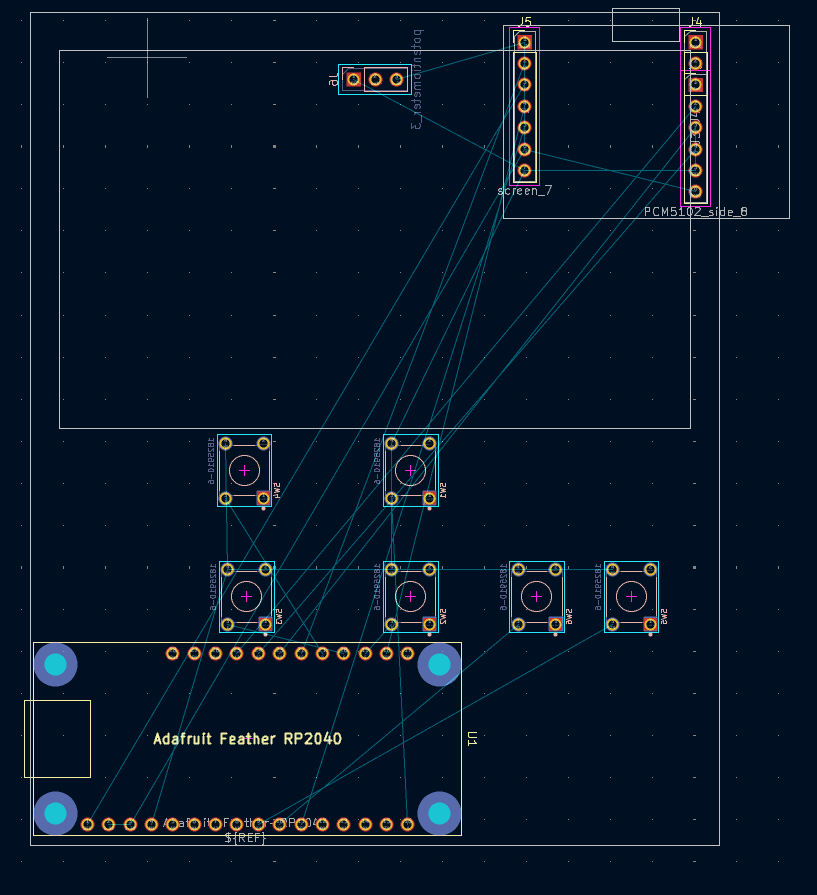

| Name    | Date Started | Project Name  | Description                                                           | Total Time |
|---------|--------------|---------------|-----------------------------------------------------------------------|------------|
| Filmona | July 31 2025 | PAP(personalaudioplayer)    | a custom built portable audio player that uses the feather rp2040 adalogger devboard alongside a pcm5102 breakoutboard   | 14 hours |

## DAY 1

I started this project really early in the morning to try and see if I could squeeze it into the last day and potentially get another projects approved, and I think I've been succesful in the first part. I did literally all of it today from deciding the dev board to CAD-ing the case. This being the 4th project that I've done I have been able to greatly shrink the time it takes me to work on projects that before would take me quite a bit of time.

I still did "waste" a lot of time though because I went through getting almost all the way through with 3 different devboard configurations before landing on this one. And then I also spent some time fumbling through the pcb because I didn't have a footprint at first for the feather adalogger. But here was how my pcb looked on like my 5th schematic iteration, after I found the footprint. 

Finding footprints was a big problem for me 